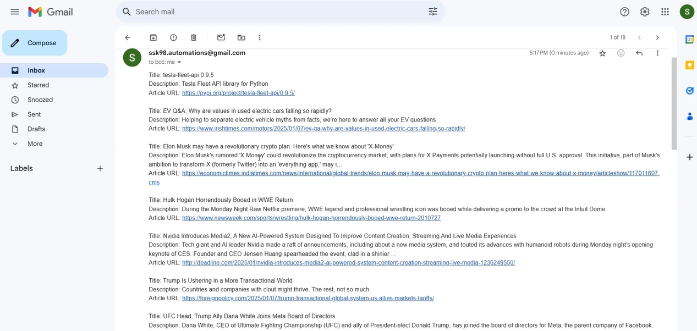
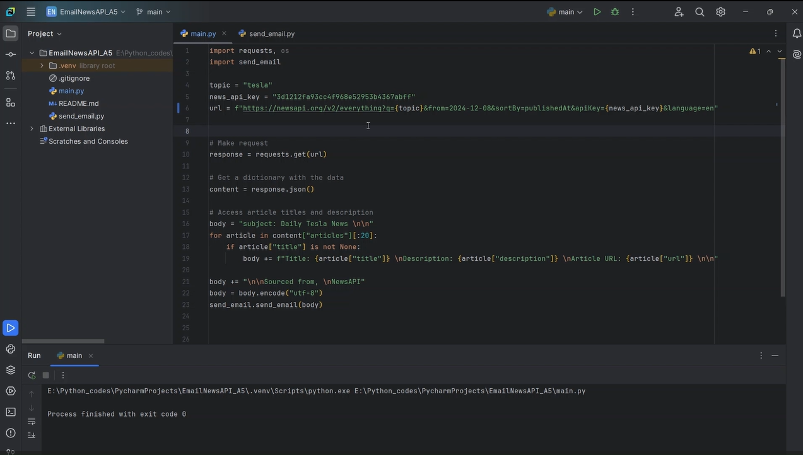

# 📰 News Email from API

A Python script that fetches the latest news articles using the **NewsAPI** and sends them as an email. This project automates the process of gathering news and delivering it directly to your inbox.

---

## 🛠️ Features

- **News API Integration**: Fetches the latest news articles based on a specified topic.
- **Email Automation**: Sends the news articles as an email using **SMTP**.
- **Customizable Topic**: Easily change the news topic (e.g., Tesla, Technology, etc.).
- **Daily Updates**: Perfect for setting up daily news digests.

---

## 🚦 How to Use

1. Install the required dependencies (`requests`, `smtplib`, and `ssl`).
2. Set up environment variables for your email credentials (`PortfolioEmailsAppPassword`).
3. Run the script to fetch news articles and send them as an email.

---

## 📸 Screenshots

---

## 🎥 Demo

---

## 📬 Contact

Feel free to explore the project and share your feedback. For any inquiries, suggestions, or contributions, reach out to me at **sathiyanarayanan.s1698@gmail.com**.
